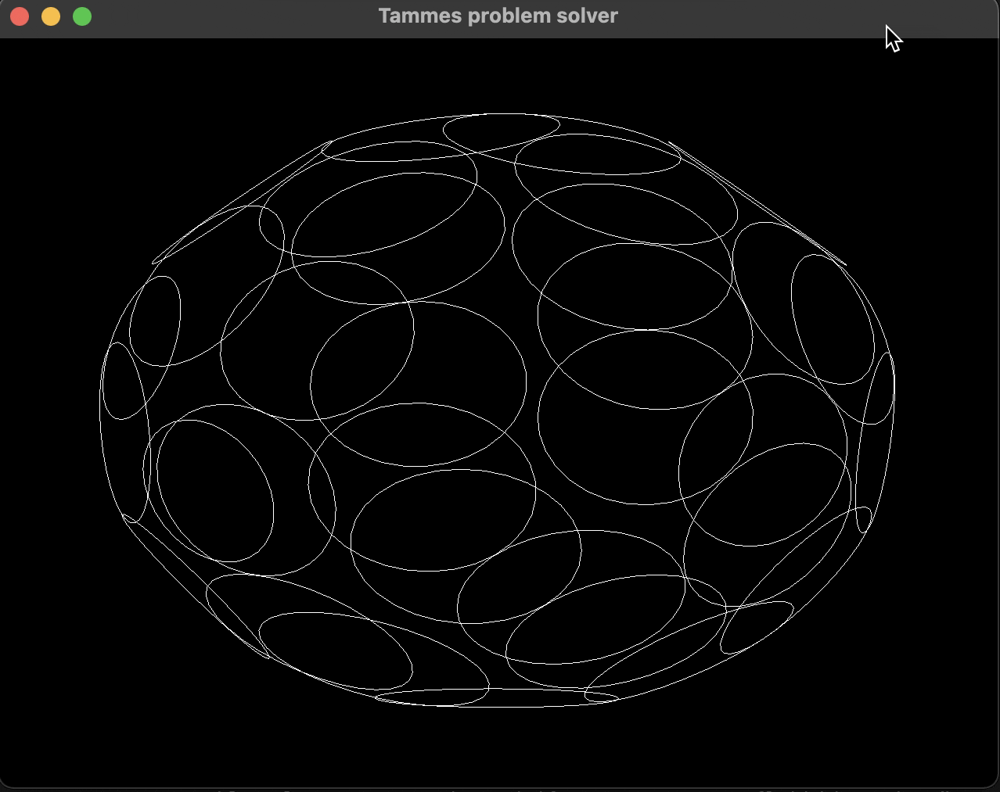

# Tammes Problem Solver

Tammes problem is the problem of distributing n circles on the surface of a sphere such that the minimum distance between the circles is maximized. It can be seen as circle packing on a sphere. There are only analytical solutions for small n's. 

It uses WGPU as a backend for rendering. This causes quite some boilerplate code but is ultimately simpler and faste than using matplotlib. 

Randomly perturbs points and checks if maximum minimum distance is increased. If that is the case, the change is kept, if not discarded. Generally unoptimized. 

