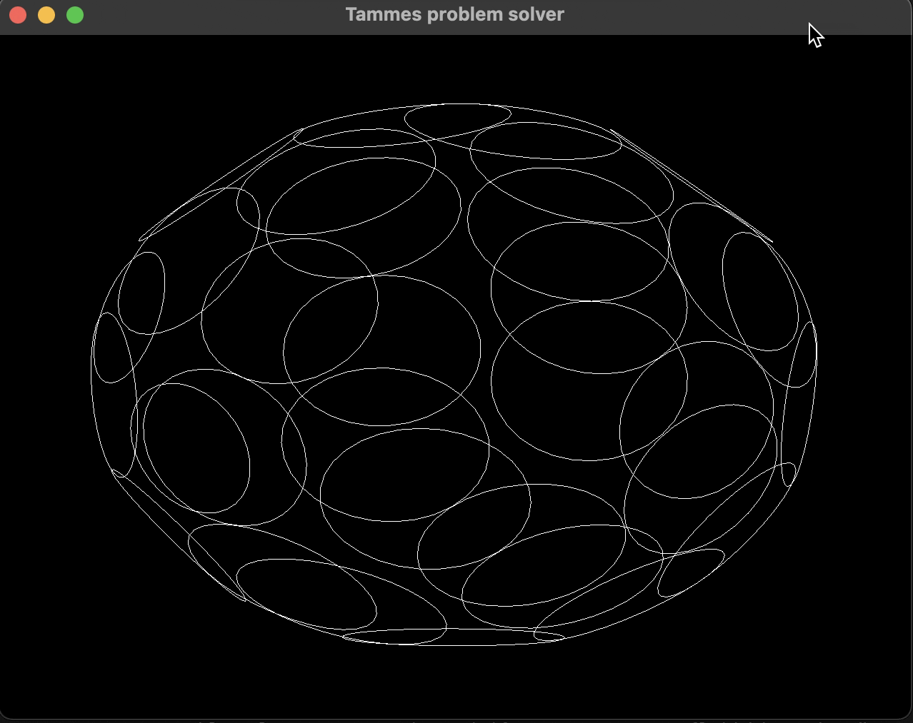

# Tammes Problem Solver

Tammes problem is the problem of distributing n circles on the surface of a sphere such that the minimum distance between the circles is maximized. It can be seen as circle packing on a sphere. There are only analytical solutions for small n's. 

